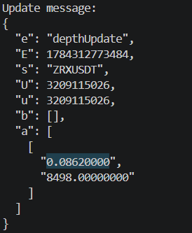
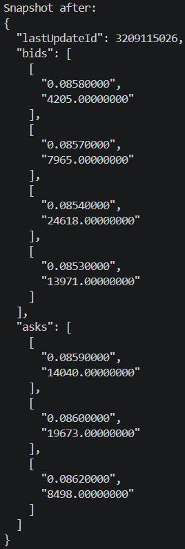
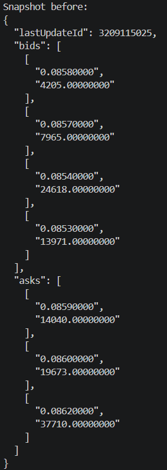

# Binance CLOB

A local, real-time mirror of Binance's central limit order book for a single trading pair.
Bootstraps from a REST depth snapshot, applies the diff-depth WebSocket stream on top of it,
detects and recovers from sequence gaps, and logs the book's state before/after every update.

## Architecture

```
BinanceClient (REST + WS, raw JSON in)
        │  Parser.parse_snapshot() / parse_diff_event()
        ▼
schemas/market_data.py  →  Snapshot / UpdateEvent / PriceLevel   (Decimal-typed, validated)
        │
        ▼
EventReader ──puts──► EventQueue ◄──gets── OrderBookSynchronizer ──drives──► OrderBook
     │                                            │                              │
     └── Monitor.record_event_received()          └── Monitor.record_*()        └── to_json()
                              (shared Monitor instance, injected into both)

main.py (composition root)
  runs EventReader.run(), OrderBookSynchronizer.run(), Monitor.run() concurrently via asyncio.gather
```

`main.py` is the only place that wires these together — every class below only knows the
abstractions it directly depends on, not each other.

- **`models/binance_client.py`** — REST snapshot fetch + async WS diff stream, both returning
  typed objects (never raw JSON).
- **`models/parser.py`** — converts raw Binance JSON into typed, validated objects
  (`MessageParseError` on malformed/missing fields — the one real trust boundary here).
- **`schemas/market_data.py`** — `PriceLevel`/`Snapshot`/`UpdateEvent` dataclasses, each with
  `to_json()` producing Binance's own wire shape.
- **`models/event_queue/`** — the queue abstraction sitting between reader and synchronizer:
  `EventQueue` (a `typing.Protocol` — structural typing, so anything with matching `put`/`get`/
  `queue_size` methods qualifies, including `asyncio.Queue` itself) and `AsyncioEventQueue`, a
  concrete implementation.
- **`models/event_reader.py`** — `EventReader` owns the WS connection lifecycle exclusively:
  forwards every diff event into its `EventQueue`, reconnecting automatically on any failure. No
  knowledge of sync state — a disconnect is just a gap in queue delivery, which is
  `OrderBookSynchronizer`'s gap check to notice, not this class's job.
- **`models/order_book.py`** — pure state: two `bids`/`asks` trees, apply/query methods. No
  network/async awareness — fully unit-testable in isolation.
- **`models/order_book_synchronizer.py`** — owns the bootstrap + gap-detection/resync state
  machine only. Takes an `EventQueue` via dependency injection (doesn't construct or manage the
  reader) and a `BinanceClient` reference used solely for `fetch_snapshot()`.
- **`models/monitor.py`** — `Monitor`/`Metrics`: a shared instance injected into both
  `EventReader` and `OrderBookSynchronizer`, tracking events received/applied, gaps, resync
  attempts/successes, reader and snapshot-fetch errors, and current queue depth. `Monitor.run()`
  logs a snapshot of all of it every 10 seconds.
- **`models/logger.py`** — console logging setup shared by `Monitor`.
- **`config.py`** — `pydantic_settings.BaseSettings` loaded from `.env`.

## Data Structure Decision

A red-black tree is a strong fit for an order book,
Each side of the book (`bids`, `asks`) is a `bintrees.RBTree` keyed by `Decimal` price:

- **Self-balancing gives worst-case O(log n)** for insert/update/remove.
  An order book takes a continuous, potentially adversarial-looking stream of price levels —
  a plain unbalanced BST can degrade to O(n) under the wrong insertion pattern (e.g. a run of
  strictly increasing prices), which a red-black tree's balancing guarantees never happens.
- **Best bid / best ask in O(log n)** via `max_item()`/`min_item()` — the two values the system
  queries constantly, always fast, never a linear scan.
- **Sorted order comes for free.** The Red-Black Trees maintain all price levels sorted by price at all times, eliminating the need for explicit sorting after each update. This allows the order book to remain correctly ordered while supporting efficient updates.
- **Trade-off** A hash map for example would provide O(1) updates, but it would not preserve price ordering. Retrieving the best bid or ask would then require an additional ordered structure or a scan. The Red-Black Tree provides a good balance between ordered access and predictable update performance.

## Key Design Decisions

- **Loosely coupled architecture.**
  The system is composed of independent components (`BinanceClient`, `EventReader`, `OrderBookSynchronizer`, `OrderBook`, and `OrderBookMonitor`), each with a single responsibility. Dependencies are injected rather than created internally, allowing components to be developed, tested, and modified independently. This separation also makes it easier to replace or extend individual components in the future without affecting the rest of the system.

- **A dedicated background reader continuously buffers incoming WebSocket events in an `asyncio.Queue`.**
  Separating WebSocket reading from order book processing ensures that incoming events are not missed while snapshots are being fetched or resynchronization is in progress.
  **Trade-off:** If updates arrive faster than they are processed, the queue may grow and increase memory usage.

- **The local order book is implemented using two Red-Black Trees.**
  The trees keep all price levels automatically sorted by price while supporting efficient insertion, update, and deletion (`O(log n)`). This allows efficient retrieval of the best bid and best ask without additional sorting.

- **Any detected gap triggers a full resynchronization.**
  Rather than attempting to recover missing updates, the local order book is rebuilt from a fresh Binance snapshot. This guarantees that the local state remains consistent with Binance's order book.

- **The order book is maintained entirely in memory.**
  Keeping the order book in memory minimizes latency and keeps the implementation simple, making updates very fast.
  **Trade-off:** The order book is lost if the application restarts and must be rebuilt by fetching a new snapshot.

## Assumptions

- The Binance REST snapshot is considered the authoritative source for initializing or recovering the local order book.
- WebSocket diff events are assumed to arrive in order unless a sequence gap is detected.
- A price level with a quantity of `0` indicates that the level should be removed from the order book.
- The implementation maintains the order book entirely in memory and does not persist state across restarts.
- The system is designed to track a single trading pair at a time.
- The implementation assumes a single-process, asynchronous execution model using `asyncio`.
- The order book only stores the latest state of each price level and does not keep historical updates.

## Out Of Scope & Future Improvements

- **Order matching and trade execution.**
  The system only maintains a local copy of Binance's order book and does not execute trades.
  **Future improvement:** Extend the project into a complete matching engine capable of accepting and matching orders.

- **Multiple trading pairs.**
  The current implementation supports a single trading pair.
  **Future improvement:** Run an independent synchronizer and order book for each trading pair.

- **Multiple exchanges.**
  The implementation is tightly coupled to Binance's REST and WebSocket APIs.
  **Future improvement:** Introduce a common market data interface so additional exchanges such as Coinbase or Kraken can be integrated without modifying the synchronization logic.

- **Persistence.**
  The order book is maintained entirely in memory and is rebuilt from a fresh snapshot after every restart.
  **Future improvement:** Persist periodic snapshots or event logs to reduce recovery time after a restart.

## Efficiency

- **Low-latency order book updates.**
  Binance diff events are received continuously through the WebSocket connection and forwarded to the `OrderBookSynchronizer` through an asynchronous event queue. Once the initial snapshot synchronization is complete, each valid event is applied immediately to the local order book. The system does not perform polling or re-sort the full order book after each update, which keeps the processing overhead low. Actual latency depends mainly on network conditions, queue backlog, and the time required to apply an update. The monitor tracks update-processing latency and queue size to help identify delays.

- **Efficient price-level operations.**
  Bids and asks are stored in separate Red-Black Trees, keyed by price. Red-Black Trees remain balanced, so inserting, updating, and removing a price level each require `O(log n)` time, where `n` is the number of price levels on the relevant side of the book. Accessing the best bid or best ask also requires `O(log n)` using the maximum or minimum tree item. The structure remains ordered automatically, so no additional sorting is required after updates.

| Operation | Time Complexity |
|---|---:|
| Insert price level | `O(log n)` |
| Update price level | `O(log n)` |
| Remove price level | `O(log n)` |
| Best bid / best ask | `O(log n)` |
| Apply an event containing `k` updates | `O(k log n)` |
| Export the first `d` levels | `O(n + d)` with the current list-based implementation |

## Scalability

The current implementation is designed for a single trading pair but can be extended to support additional workloads with minimal architectural changes.

- **Independent processing per trading pair.** Each trading pair can have its own `EventReader`, `OrderBookSynchronizer`, `OrderBook`, and `EventQueue`, allowing multiple books to run concurrently within the same application.

- **Decoupled event ingestion and processing.** The `EventReader` continuously receives WebSocket events and places them into an event queue, while the `OrderBookSynchronizer` consumes and applies updates independently. This separation prevents temporary processing delays from blocking network I/O.

- **Queue abstraction for future scaling.** The `EventReader` and `OrderBookSynchronizer` communicate through an `EventQueue` abstraction rather than depending on a specific queue implementation. While the current implementation uses an in-memory `asyncio.Queue`, the same architecture could support an external message broker (e.g., RabbitMQ or Kafka) with minimal changes, enabling the reader and synchronizer to run in separate processes or even on different machines.

- **Modular architecture.** Each component has a single responsibility and communicates through well-defined interfaces, making it straightforward to extend or replace individual modules without affecting the rest of the system.

- **Future horizontal scaling.** If processing a large number of trading pairs becomes necessary, different symbols can be distributed across multiple processes or machines, with each instance maintaining its own local order book independently.

## Persistence & Recovery

- **Handling missed WebSocket events.**
  The synchronizer validates the sequence of every incoming update by comparing the event's `first_update_id` with the local order book's `last_update_id + 1`. If the values do not match, the event stream is considered inconsistent and a sequence gap is recorded by the monitor. The synchronizer then leaves the `SYNCED` state and starts a full resynchronization process rather than continuing with potentially corrupted data.

- **Recovering to a consistent state.**
  During resynchronization, the synchronizer fetches a fresh Binance REST snapshot and consumes buffered WebSocket events from the queue. Events that are already included in the snapshot are discarded. The synchronizer searches for the first event whose update range connects correctly to `snapshot.last_update_id + 1`. If the buffered event is already ahead of the snapshot, another snapshot is fetched until a valid bridge between the snapshot and the event stream is found. The snapshot is then applied, followed by the bridging event, and the system returns to the `SYNCED` state.

- **In-memory recovery model.**
  The current implementation does not persist the order book or event stream to disk. If the application restarts, the local state is rebuilt from a new Binance snapshot and the live WebSocket stream. This keeps the implementation lightweight and avoids disk I/O, serialization, and persistent storage management.

- **Durability trade-off.**
  An in-memory design provides low operational complexity and fast update processing, but the local order book is lost when the process terminates. This is acceptable because Binance remains the authoritative source and the complete current state can be reconstructed through resynchronization. A more durable production implementation could persist periodic snapshots or append incoming events to an event log, reducing recovery time and enabling historical replay, at the cost of additional storage, consistency, and failure-handling complexity.

## Testing Plan

The testing strategy focuses on validating the correctness of the order book data structure, the synchronization process, and the system's recovery behavior.

### Unit Tests

- **Order book operations.**
  Verify that price levels can be inserted, updated, and removed correctly on both the bid and ask sides.

- **Best bid and best ask.**
  Confirm that the highest bid and lowest ask are returned after different combinations of updates.

- **Snapshot application.**
  Verify that applying a snapshot replaces the existing order book state and correctly updates `last_update_id`.

- **Diff event application.**
  Confirm that all bid and ask updates in an event are applied correctly and that price levels with a quantity of zero are removed.

- **Sequence-gap detection.**
  Test that the synchronizer identifies an event whose sequence does not continue from the local `last_update_id`.

### Synchronization Tests

- **Successful initial synchronization.**
  Provide a snapshot and a buffered event whose update range connects to the snapshot, and verify that both are applied in the correct order.

- **Discarding outdated events.**
  Confirm that events whose `final_update_id` is less than or equal to the snapshot's `last_update_id` are ignored during synchronization.

- **Snapshot-to-stream bridging.**
  Verify that synchronization succeeds when the first valid buffered event contains `snapshot.last_update_id + 1` within its update range.

- **Snapshot retry.**
  Simulate a buffered event that is ahead of the fetched snapshot and verify that a newer snapshot is requested.

- **Recovery after a gap.**
  Start from a synchronized state, provide an event with a missing sequence, and verify that the synchronizer records the gap and begins resynchronization.

- **Snapshot fetch failure.**
  Simulate temporary REST failures and verify that the synchronizer retries without terminating.

### Integration Tests

- **Snapshot and WebSocket integration.**
  Run the reader and synchronizer together using mocked Binance responses and verify that the local order book reaches the expected state.

- **Continuous event stream.**
  Feed a sequence of valid update events and compare the resulting local book with an expected order book.

- **Disconnect and reconnect.**
  Simulate a WebSocket disconnection and verify that the reader reconnects and that the synchronizer can recover if events were missed.

### Edge Cases

- Deleting a price level that is already absent.
- Duplicate or outdated events.
- Events containing multiple bid and ask updates.
- A sequence gap immediately after initial synchronization.
- Multiple consecutive snapshot-fetch failures.

External Binance APIs should be mocked in automated tests to keep the tests deterministic, fast, and independent of network availability. A small end-to-end test against Binance's test or live API may be used separately as a manual verification step.

## Monitoring

A lightweight in-memory monitoring component was implemented to provide visibility into the system's runtime behavior without introducing external infrastructure or dependencies.

The current monitor tracks basic operational metrics, including:

- Number of WebSocket events received.
- Number of events successfully applied to the local order book.
- Number of detected sequence gaps.
- Number of resynchronization attempts and successful recoveries.
- Number of snapshot-fetch failures.
- Current and maximum observed queue size.

These metrics can be logged periodically as a concise system-health summary. This makes it possible to identify common issues such as repeated resynchronizations, a growing event backlog, snapshot failures, or unusually slow update processing.

### Ideal Production Monitoring

In a production environment, the in-memory monitor would be replaced or extended with a dedicated monitoring stack such as Prometheus and Grafana.

The main metrics would include:

- **Event throughput:** number of events received and applied per second.
- **End-to-end market-data latency:** time between the exchange event timestamp and the local application of the update.
- **Processing latency:** average, percentile, and maximum time required to apply an event.
- **Queue backlog:** current queue depth, growth rate, and oldest queued-event age.
- **Synchronization health:** current synchronization state, time since the last successful synchronization, and resynchronization frequency.
- **Sequence integrity:** number of gaps, duplicate events, and outdated events.
- **Connection health:** WebSocket disconnections, reconnect attempts, connection uptime, and REST request failures.
- **Resource usage:** CPU usage, memory consumption, task count, and event-loop delay.

Structured logs should accompany the metrics and include useful context such as the trading symbol, update IDs, synchronization state, error type, and resynchronization reason. This would allow production incidents to be investigated by correlating monitoring alerts with specific events in the logs.

## Deliverable: book before/after an update

The following example demonstrates how the local order book changes after applying a single Binance diff event.

The WebSocket event:



The local order book immediately before applying the diff event.



The local order book after successfully applying the update.



## Setup & running

Requires [Pipenv](https://pipenv.pypa.io/).

```bash
pipenv install
cp .env.example .env   # fill in BINANCE_REST_URL / BINANCE_WS_BASE_URL if left blank
pipenv run python main.py
```
